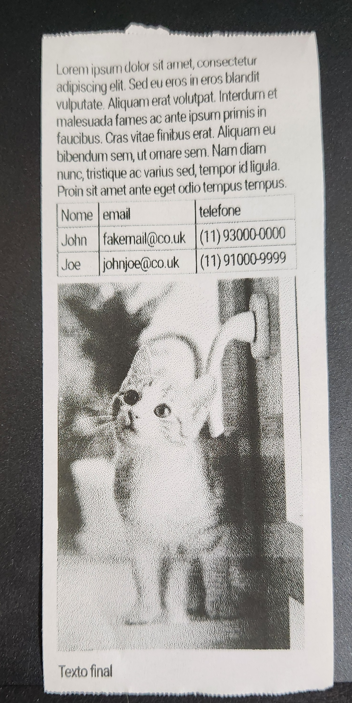

# thermal-printer-design-tool

### Thermal Printer Design tool to generate notes to print in thermal printers

### Todo
- Create html builder
- Set printer params (resolution, paper size)
- Scale calibration to preview real size
- Simple backend to one click print

Result preview:

### How to use it?

- open in browser, edit html and click in export image
- in pyprinter.py, set printer connection parameters
- runs script to print

* note: set printer resolution in .printable-area css class in style-base.css
 

### \#TrashCodeForIA \#TrashCodeBackup
